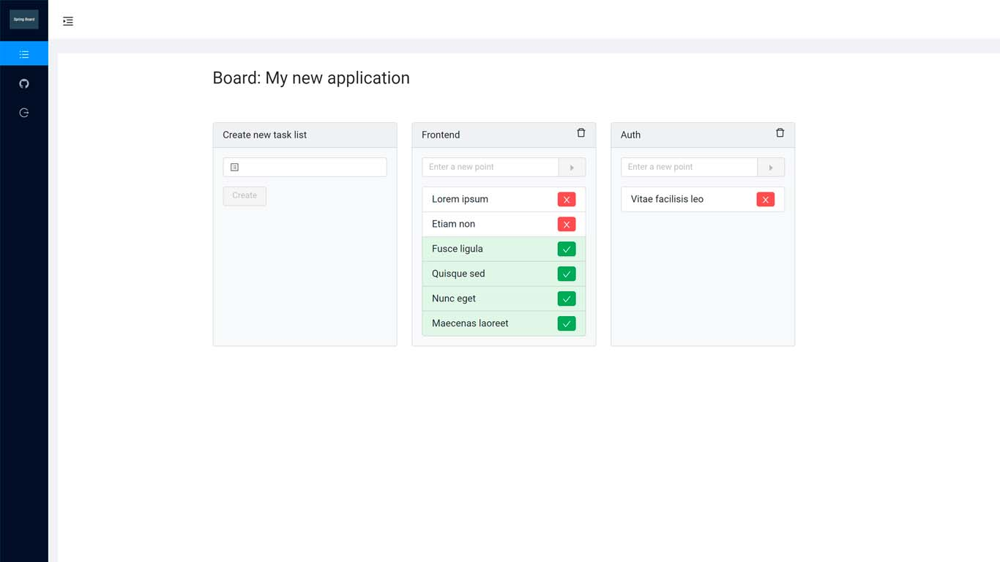

## Spring Board

### About

You can create and manage various boards, tasks and mark the status points of their completion.

Deployed on Heroku cloud platform, may take a long time to load or be unavailable:

[spring-board-app.herokuapp.com](https://spring-board-app.herokuapp.com/)



### Tools

* Java
* Spring Boot
* Spring Security
* PostgreSQL
* Liquibase
* NuxtJS

### Features

* Reactive interface without page refresh
* Register & auth with JWT tokens
* Desks management, one desk can contain many tasks
* Task management, one task can contain many points to complete

### Requirements

* Java 11 with Maven
* Node Package Manager
* PostgreSQL

### Start up

Configure database connection: src/main/resources/application.properties

```
$> mvn clean package
$> java -jar target/spring-board-1.0.0.jar
```
